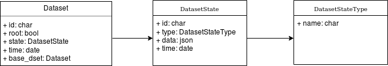

# chimedb.dataset - CHIME dataset table definitions

This package, built on top of [chimedb.core](https://github.com/chime-experiment/chimedb), defines the
dataset and state tables used by `comet` to track metadata.

## Installing

Install directly from GitHub:
```
pip install git+ssh://git@github.com/chime-experiment/chimedb_dataset.git
```

If, instead, you're installing from a local clone, read the installation instructions in the
[chimedb.core README.md](https://github.com/chime-experiment/chimedb/) for an important caveat.

## Contents

The table classes provided in `chimedb.dataset` are:
* Dataset
* DatasetState
* DatasetStateType



Edit the diagram: https://www.draw.io/#Hchime-experiment%2Fchimedb_dataset%2Fmaster%2Fdm.png
